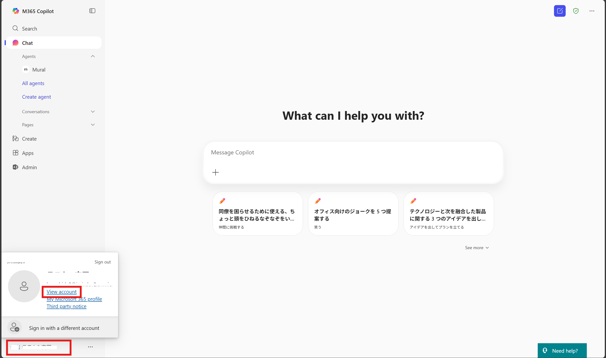

# 事前準備
今回のハンズオンでは、以下の準備を行います。 
 
 

## サインイン
1. 講師から直前にアカウント情報を配布します。 
**【アカウント例】**

| アカウント名 | メールアドレス | パスワード |
|--------------|----------------|------------| 
| user1 | user1@example.com | Password1! |

2. Microsoft EdgeまたはGoogle Chromeを起動します。

3. 画面右上の[・・・] > [新しい InPrivate ウィンドウ]（Edgeの場合）または[新しいシークレット ウィンドウ]（Chromeの場合）をクリックし、プライベートブラウズモードを開きます。 
 
> [!NOTE]
> 今回のハンズオンでは、全てこのプライベートブラウズモードを使用します。 
> プライベートブラウズモードを使用すると、キャッシュやCookieの影響を受けずにサインインできます。

4. https://m365.cloud.microsoft/?auth=2 にアクセスし、配布されたアカウント情報でサインインします。

## 言語の切り替え
1. サインイン後、画面左下のアカウント名> [View Account]をクリックします。 

2. [Setting&privacy]をクリックします。 

3. [Display Language] > [Change display language]をクリックします。 

4. [Japanese（Japan）]を選択し、[Select]クリックします。 

5. [Update]をクリックします。 

6. 一度サインアウトを求められます。画面の指示に従って一度サインアウトし、再度サインインします。

> [!IMPORTANT] 
> 再度サインインしても、My Account上では表示言語が切り替わっていない場合があります。 
> https://m365.cloud.microsoft/ にアクセスし、言語が日本語に切り替わっていたら問題ありませんので、次のステップに進んでください。 

# 次のステップ
[Agents in SharePoint でエージェントを作成する](1-agents-in-sharepoint.md)
