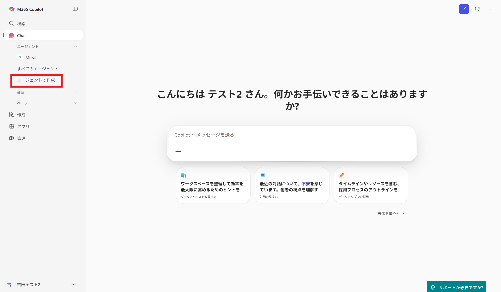
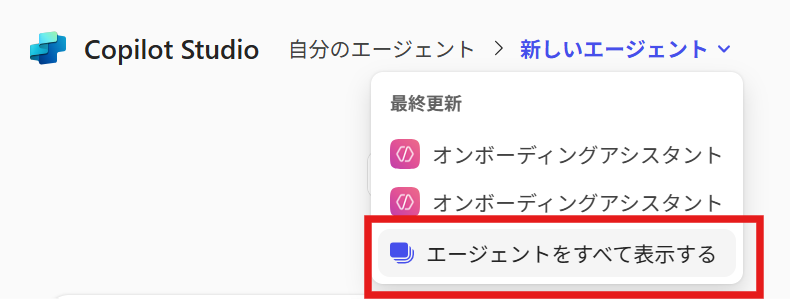
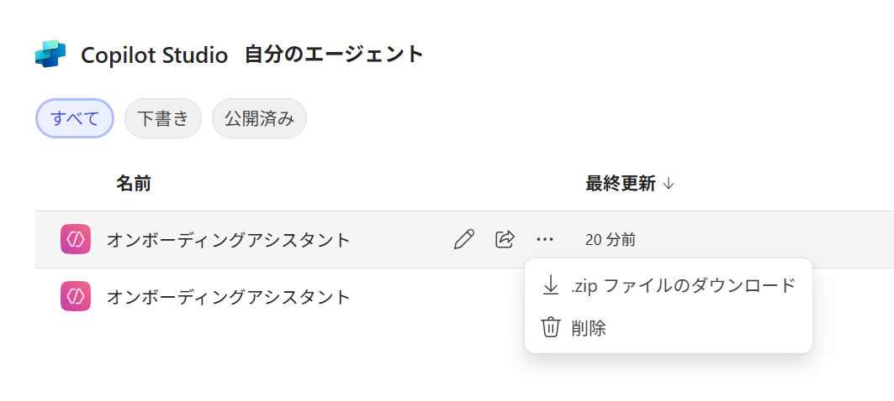
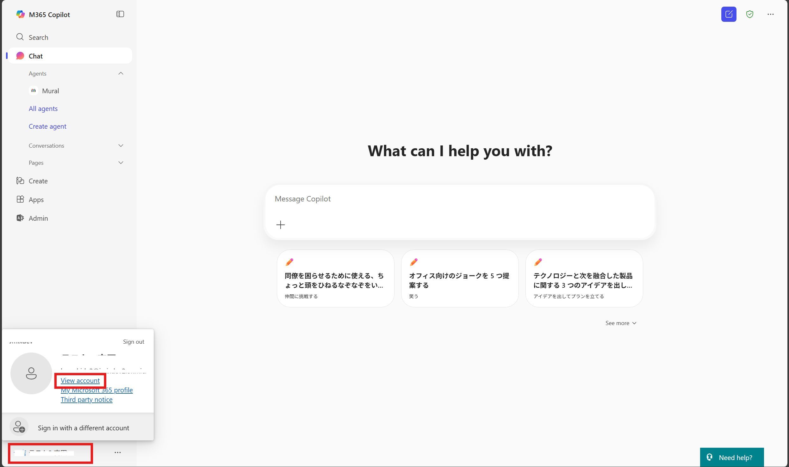
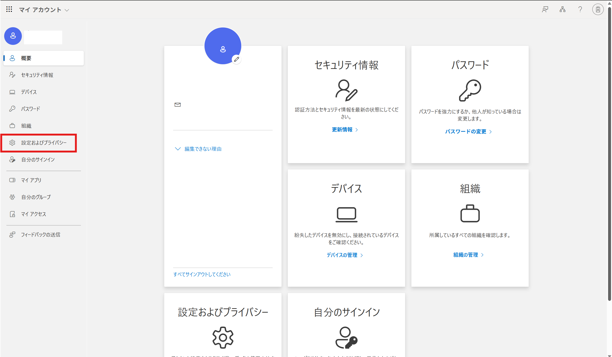
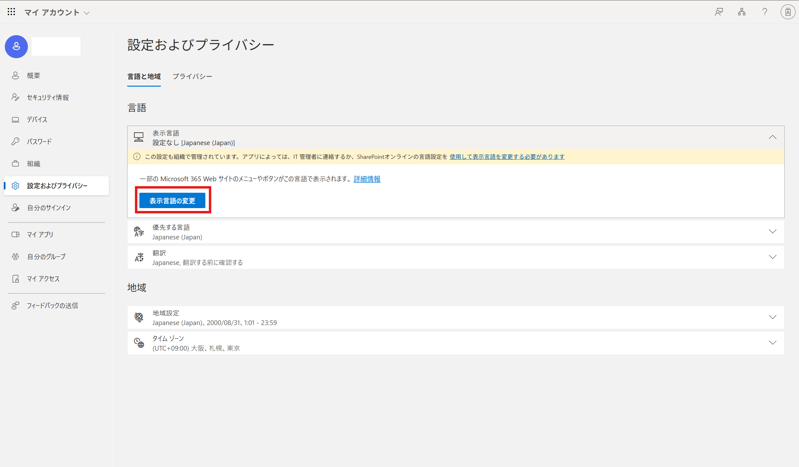
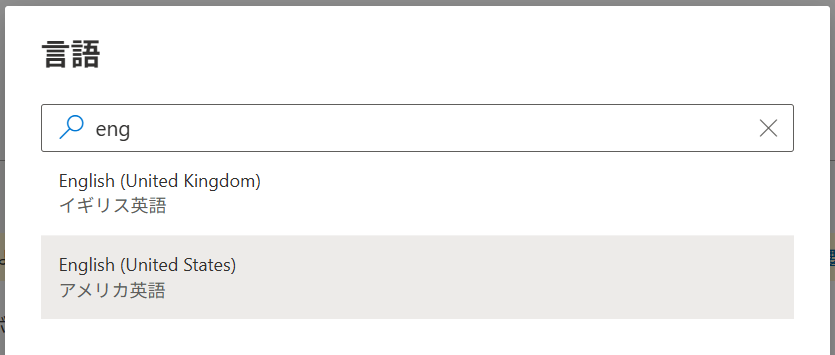
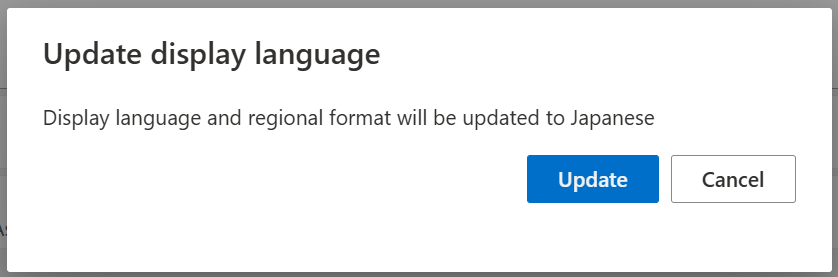

# 環境をクリーンアップする
ハンズオン終了後は、環境のクリーンアップをお願いいたします。 
 
 

## エージェントの削除
### Agents in SharePoint
1. [IT Help01]のSharePointサイト>ドキュメントに移動します。
2. 自分が作成したエージェントを選択し、[削除]をクリックします。 
 
 
 

### Agents Builder
1. [Copilot | Microsoft 365](https://m365.cloud.microsoft/chat/) を開きます。
2. 左ペインから[エージェントの作成]をクリックします。 

3. 新しいエージェントから、[エージェントをすべて表示する]をクリックします。 
 
4. 自分が作成したエージェントを選択し、[削除]をクリックします。 
 
 
 
 

## 言語の切り替え
1. 画面左下のアカウント名> [View Account]をクリックします。 

2. [設定およびプライバシー]をクリックします。 

3. [表示言語] > [表示言語の変更]をクリックします。 

4. [English（United States）]を選択し、[選択]クリックします。 

> [!IMPORTANT] 
> United Statesに切り替えられないときは、[English (United Kingdom)]など別の言語を選択してください。

5. [Update]をクリックします。 

6. 一度サインアウトを求められます。画面の指示に従って一度サインアウトし、再度サインインします。 

