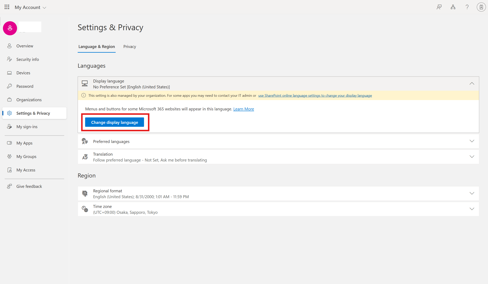

# 環境をクリーンアップする
ハンズオン終了後は、環境のクリーンアップをお願いいたします。 
 

## エージェントの削除
### Agents in SharePoint
1. [IT Help01]のSharePointサイト>ドキュメントに移動します。
2. 自分が作成したエージェントを選択し、[削除]をクリックします。 
 

### Agents Builder
1. [Copilot | Microsoft 365](https://m365.cloud.microsoft/chat/) を開きます。
2. 自分が作成したエージェントを選択し、[アンインストール]をクリックします。 
 
3. 確認ダイアログが表示されるので、[アンインストール]をクリックします。 
 
 

## 言語の切り替え
1. [Copilot | Microsoft 365](https://m365.cloud.microsoft/chat/) を開きます。
1. 画面左下のオプション>歯車マーク> [Settings]をクリックします。

2. [Language and time zone]をクリックします。

3. [Display Language] > [Change display language]をクリックします。 

4. [English (United States)]を選択し、[Select]クリックします。 
 
> [!IMPORTANT] 
> United Statesに切り替えられないときは、[English (United Kingdom)]を選択してください。

5. [Update]をクリックします。 

6. 一度サインアウトを求められます。画面の指示に従って一度サインアウトし、再度サインインします。

